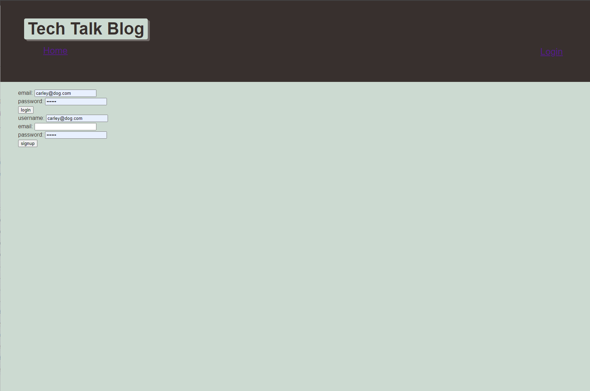

# TechTalkBlog

## A Blog for all the Tech Talk you every wanted.
- Bringing tech talk to everyone 
- There are topics on wevery kind of tech, from small projects to massive ones
- Is there some new tech you've heard about and want to find out more about? Post here and start a conversation about it
- Wondering how old tech is being rolled into new discoveries? 
- Join us and jump into or start an interesting conversation today
***
## Installation
- npm i
***
## Usage

<!-- 
 -->

***
## Credits

https://dashboard.heroku.com/apps/protected-scrubland-29162

https://github.com/BigEVK

https://github.com/BigEVK/TechTalkBlog
***
## Badges

<!--  -->

